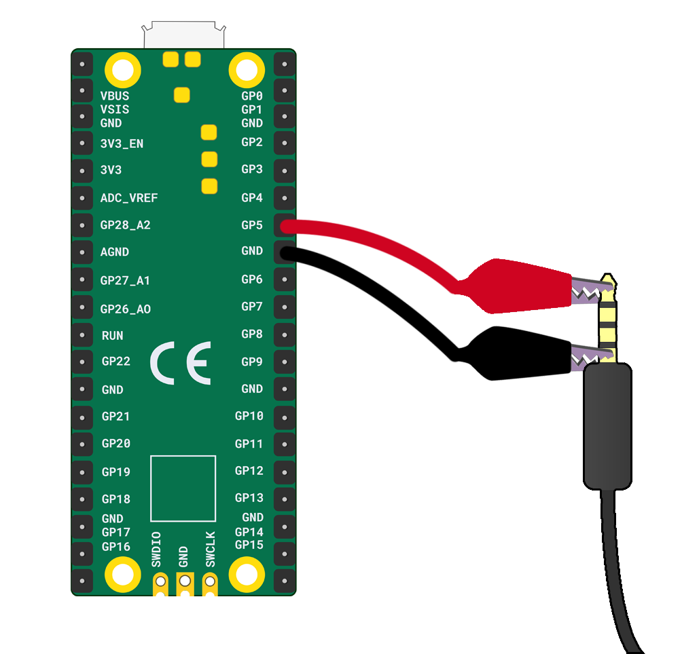

To connect earphones to your Raspberry Pi Pico, you will need:

+ A Raspberry Pi Pico
+ A pair of earphones with a 3 or 5mm jack (not a USB end)
+ 3 x crocodile clips

**Instructions**

1. Decide which crocodile clip will be for **ground** and which will be for the **GP** pins. 

2. Take your first **GP** pin crocodile clip and attach it to the tip of the jack. 

3. Take the other end of your **GP** pin crocodile clip and attach it to the **GP5** pin.

4. Take your second **GP** pin crocodile clip and attach it to the middle of the jack. 

5. Take the other end of your **GP** pin crocodile clip and attach it to the **GP10** pin.

6. Take your **ground** crocodile clip and attach one end to the base of the jack. 

7. Connect the other end of your **ground** crocodile clip to a **GND** pin. 

 