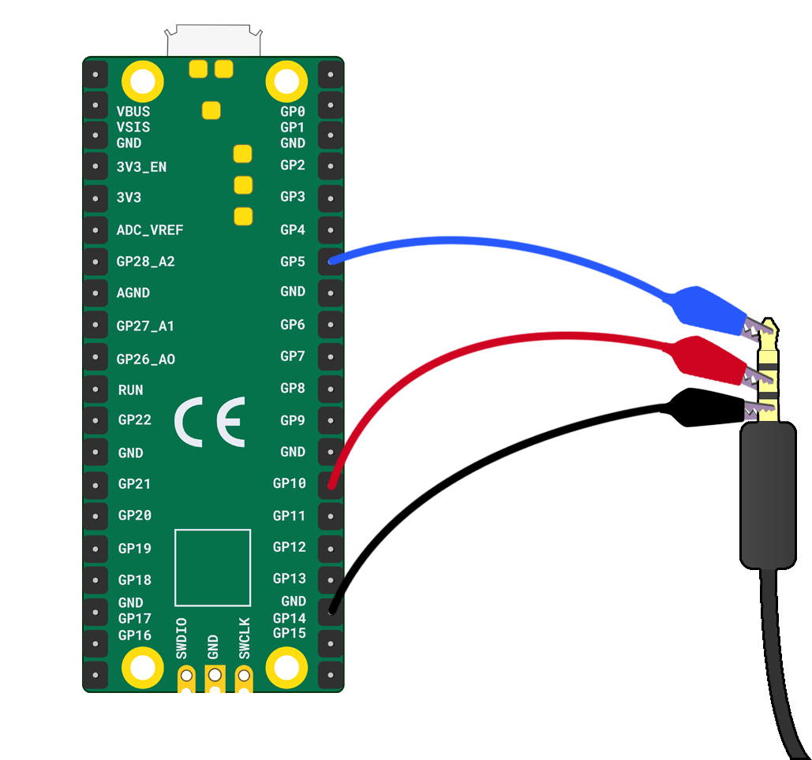

Om een koptelefoon op je Raspberry Pi Pico aan te sluiten, heb je het volgende nodig:

+ Een Raspberry Pi Pico
+ Een koptelefoon met een plug van 3 of 5 mm (dus geen USB-aansluiting)
+ 3 krokodillenklemmetjes

**Instructies**

1. Bepaal welk krokodillenklemmetje voor **aarde** is en welk voor de **GP** pinnen.

2. Neem je eerste **GP** krokodillenklemmetje en bevestig deze aan het puntje van de plug.

3. Neem het andere uiteinde van je **GP** krokodillenklemmetje en bevestig deze aan de **GP5** pin.

4. Neem je tweede **GP** krokodillenklemmetje en bevestig deze in het midden van de plug.

5. Neem het andere uiteinde van je **GP** krokodillenklemmetje en bevestig deze aan de **GP10** pin.

6. Neem je **aarde** krokodillenklemmetje en bevestig deze aan de basis van de plug.

7. Neem het andere uiteinde van je **aarde** krokodillenklemmetje en bevestig deze aan de **GND** pin.

 